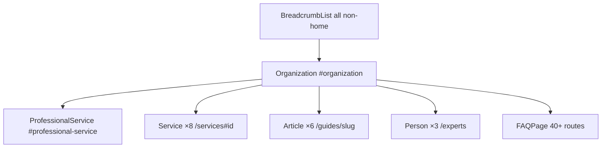

# SEO Architecture — africaexpertwitness.com

**Canonical domain:** `https://www.africaexpertwitness.com`  
**Site name:** AfricaExpertWitness  
**Locale:** `en_GB` (UK solicitors, immigration practitioners, arbitration counsel)

This document is the single source of truth for keyword strategy, content clusters, internal linking, structured data, GEO (Generative Engine Optimization), off-page SEO, competitor monitoring, expansion, and launch. All slugs and URLs align with `data/*.ts` and `lib/schema.ts`.

**Implementation status (summary):** Full site built (62 SSG pages). SEO architecture implemented: internal linking, schema, GEO tables, sitemap, glossary anchors. See [Appendix F](#appendix-f-implementation-status-matrix) and [PROJECT-SUMMARY.md](./PROJECT-SUMMARY.md).

---

## 1. Keyword Strategy

### Tier 1 — Transactional

**Target pages:** homepage, services, region pages, country pages.

#### Primary

| Keyword | Primary URL |
|---------|-------------|
| africa expert witness | `/` |
| africa expert witness UK | `/` |
| african country expert witness | `/countries`, `/expertise-areas/country-conditions-human-rights` |
| africa asylum expert witness UK | `/`, `/case-types/asylum-appeal-first-tier-tribunal` |
| africa country conditions expert witness | `/expertise-areas/country-conditions-human-rights` |

#### Regional

| Keyword | Primary URL |
|---------|-------------|
| east africa expert witness UK | `/regions/east-africa` |
| west africa expert witness UK | `/regions/west-africa` |
| horn of africa expert witness | `/regions/horn-of-africa` |
| southern africa expert witness | `/regions/southern-africa` |
| north africa expert witness UK | `/regions/north-africa` |

#### Country-specific (12 primary targets)

| Keyword | Primary URL | Data |
|---------|-------------|------|
| nigeria expert witness UK | `/countries/nigeria` | `data/countries.ts` |
| somalia expert witness UK | `/countries/somalia` | `data/countries.ts` |
| eritrea expert witness UK | `/countries/eritrea` | `data/countries.ts` |
| ethiopia expert witness UK | `/countries/ethiopia` | `data/countries.ts` |
| sudan expert witness UK | `/countries/sudan` | `data/countries.ts` |
| zimbabwe expert witness UK | `/countries/zimbabwe` | `data/countries.ts` |
| DRC expert witness UK | `/countries/democratic-republic-of-congo` | `data/countries.ts` |
| ghana expert witness UK | `/countries/ghana` | `data/countries.ts` |
| kenya expert witness UK | `/countries/kenya` | `data/countries.ts` |
| uganda expert witness UK | `/countries/uganda` | `data/countries.ts` |
| guinea expert witness | `/countries/guinea` | `data/countries.ts` |
| libya expert witness UK | `/countries/libya` | `data/countries.ts` |

#### Specialist

| Keyword | Primary URL |
|---------|-------------|
| lgbtqi africa expert witness UK | `/expertise-areas/lgbtqi-asylum-africa` |
| fgm expert witness UK africa | `/expertise-areas/fgm-gender-based-violence` |
| africa investment arbitration expert | `/expertise-areas/investment-treaty-arbitration-africa` |
| africa mining expert witness ICSID | `/expertise-areas/investment-treaty-arbitration-africa`, `/guides/west-africa-mining-arbitration` |
| west africa mining arbitration expert | `/guides/west-africa-mining-arbitration`, `/regions/west-africa` |

### Tier 2 — Informational

**Target pages:** guides, FAQ.

| Keyword | Primary URL |
|---------|-------------|
| what is somalia country guidance MOJ | `/guides/somalia-country-guidance-moj` |
| how to challenge home office CPIN africa | `/guides/home-office-cpin-africa-rebuttal` |
| eritrea military service asylum UK | `/countries/eritrea`, `/guides/somalia-country-guidance-moj` (MA cross-link) |
| uganda anti homosexuality act asylum | `/countries/uganda`, `/guides/lgbtqi-africa-asylum-evidence` |
| guinea icsid arbitration expert | `/countries/guinea`, `/guides/west-africa-mining-arbitration` |
| fgm prevalence west africa asylum | `/expertise-areas/fgm-gender-based-violence`, `/regions/west-africa` |
| legal aid africa expert witness report | `/guides/instructing-africa-experts-legal-aid`, `/fees` |
| africa expert witness report turnaround | `/how-to-instruct`, `/faq` |
| ethiopia tigray asylum expert witness | `/countries/ethiopia` |
| zimbabwe political persecution expert | `/countries/zimbabwe`, `/expertise-areas/political-persecution-state-protection` |

### Tier 3 — Long-tail

**Target pages:** country pages, expertise pages, case-type pages, FAQ.

| Keyword | Primary URL(s) |
|---------|----------------|
| somalia expert witness first tier tribunal | `/countries/somalia`, `/case-types/asylum-appeal-first-tier-tribunal` |
| eritrea forced conscription expert report | `/countries/eritrea` |
| nigeria LGBTQI+ asylum expert witness | `/countries/nigeria`, `/expertise-areas/lgbtqi-asylum-africa` |
| guinea fgm expert witness UK | `/countries/guinea`, `/expertise-areas/fgm-gender-based-violence` |
| mali mining arbitration expert witness | *No country page yet — see Section 8* |
| kenya anti homosexuality expert evidence | `/countries/kenya`, `/expertise-areas/lgbtqi-asylum-africa` |
| DRC cobalt mining ICSID expert | `/countries/democratic-republic-of-congo`, `/case-types/investment-treaty-icsid-arbitration` |
| sudan darfur asylum expert witness UK | `/countries/sudan` |
| ethiopia oromo persecution expert report | `/countries/ethiopia` |
| africa expert witness fees legal aid | `/fees`, `/guides/instructing-africa-experts-legal-aid` |

### Keyword → URL implementation reference

| Cluster | URL pattern | Meta source |
|---------|-------------|-------------|
| Brand / transactional | `/` | Build homepage `metaTitle` / `metaDescription` |
| Country transactional | `/countries/{slug}` | `metaTitle`, `metaDescription` in `data/countries.ts` |
| Regional transactional | `/regions/{slug}` | `data/regions.ts` |
| Expertise transactional | `/expertise-areas/{slug}` | `data/expertise-areas.ts` |
| Case-type transactional | `/case-types/{slug}` | `data/case-types.ts` |
| Informational | `/guides/{slug}` | `data/guides.ts` |
| Utility / process | `/how-to-instruct`, `/fees`, `/faq` | Page-level metadata |

---

## 2. Content Cluster Map

Eight topical hubs drive internal linking, anchor text, and content depth. Each hub has a pillar URL and supporting pages.

### Hub 1: Somalia & Horn of Africa

| Role | URL |
|------|-----|
| Pillar | `/regions/horn-of-africa` |
| Supporting | `/countries/somalia`, `/countries/eritrea`, `/countries/ethiopia`, `/countries/sudan` |
| Guide | `/guides/somalia-country-guidance-moj` |
| Case type | `/case-types/asylum-appeal-first-tier-tribunal` |
| Glossary | `/glossary#moj-ors-somalia-cg-2014`, `/glossary#ma-draft-evaders-eritrea-cg-2019`, `/glossary#al-shabaab` |

### Hub 2: LGBTQI+ Asylum Africa

| Role | URL |
|------|-----|
| Pillar | `/expertise-areas/lgbtqi-asylum-africa` |
| Supporting | `/guides/lgbtqi-africa-asylum-evidence`, `/countries/uganda`, `/countries/nigeria`, `/countries/ghana`, `/countries/kenya` |
| Case type | `/case-types/lgbtqi-asylum-africa-cases` |
| Glossary | `/glossary#anti-homosexuality-act-2023-uganda`, `/glossary#hj-iran-standard-lgbtqi-asylum-test` |
| FAQ | `/faq` (LGBTQI+ Q&As) |

### Hub 3: FGM & Gender-Based Violence

| Role | URL |
|------|-----|
| Pillar | `/expertise-areas/fgm-gender-based-violence` |
| Supporting | `/guides/fgm-expert-evidence-africa`, `/countries/guinea`, `/countries/nigeria`, `/countries/somalia`, `/regions/west-africa` |
| Case type | `/case-types/fgm-asylum-cases` |
| Glossary | `/glossary#fgm-female-genital-mutilation` |
| FAQ | `/faq` (FGM Q&As) |

### Hub 4: West Africa Mining Arbitration

| Role | URL |
|------|-----|
| Pillar | `/expertise-areas/investment-treaty-arbitration-africa` |
| Supporting | `/guides/west-africa-mining-arbitration`, `/countries/guinea`, `/countries/libya`, `/regions/west-africa` |
| Case type | `/case-types/investment-treaty-icsid-arbitration` |
| Glossary | `/glossary#icsid-international-centre-for-settlement-of-investment-disputes`, `/glossary#ohada-organisation-for-the-harmonisation-of-business-law-in-africa` |
| FAQ | `/faq` (arbitration Q&As) |

### Hub 5: Home Office CPIN Challenges

| Role | URL |
|------|-----|
| Pillar | `/guides/home-office-cpin-africa-rebuttal` |
| Supporting | `/services#rebuttal-sje`, `/case-types/upper-tribunal-country-guidance` |
| Glossary | `/glossary#country-policy-information-note-cpin`, `/glossary#country-guidance-case` |
| FAQ | `/faq` (country guidance Q&As) |

### Hub 6: Legal Aid Instruction

| Role | URL |
|------|-----|
| Pillar | `/guides/instructing-africa-experts-legal-aid` |
| Supporting | `/fees` (Legal Aid section), `/how-to-instruct` |
| Glossary | `/glossary#legal-aid` |
| FAQ | `/faq` (Legal Aid Q&As) |

### Hub 7: Southern Africa

| Role | URL |
|------|-----|
| Pillar | `/regions/southern-africa` |
| Supporting | `/countries/zimbabwe`, `/countries/democratic-republic-of-congo` |
| Glossary | `/glossary#rn-zimbabwe-cg-2008` |
| Case type | `/case-types/commercial-litigation-african-law` |

### Hub 8: North Africa & Investment

| Role | URL |
|------|-----|
| Pillar | `/regions/north-africa` |
| Supporting | `/countries/libya`, `/expertise-areas/investment-treaty-arbitration-africa`, `/case-types/investment-treaty-icsid-arbitration` |

### Slug inventory (data layer)

**Regions (5):** `east-africa`, `west-africa`, `horn-of-africa`, `southern-africa`, `north-africa`

**Countries (12):** `nigeria`, `somalia`, `eritrea`, `ethiopia`, `sudan`, `zimbabwe`, `democratic-republic-of-congo`, `ghana`, `kenya`, `uganda`, `guinea`, `libya`

**Expertise areas (8):** `political-persecution-state-protection`, `lgbtqi-asylum-africa`, `fgm-gender-based-violence`, `trafficking-modern-slavery-africa`, `investment-treaty-arbitration-africa`, `african-law-legal-systems`, `nationality-statelessness`, `country-conditions-human-rights`

**Case types (8):** `asylum-appeal-first-tier-tribunal`, `upper-tribunal-country-guidance`, `lgbtqi-asylum-africa-cases`, `fgm-asylum-cases`, `trafficking-modern-slavery-cases`, `investment-treaty-icsid-arbitration`, `commercial-litigation-african-law`, `extradition-africa`

**Guides (6):** `somalia-country-guidance-moj`, `lgbtqi-africa-asylum-evidence`, `fgm-expert-evidence-africa`, `west-africa-mining-arbitration`, `home-office-cpin-africa-rebuttal`, `instructing-africa-experts-legal-aid`

**Services (8 IDs):** `country-condition-reports`, `lgbtqi-asylum`, `fgm-gbv`, `trafficking`, `investment-arbitration`, `african-law`, `nationality-statelessness`, `rebuttal-sje`

### Glossary anchor ID convention

Generate fragment IDs from term text:

```js
term.toLowerCase().replace(/[^a-z0-9]+/g, "-").replace(/^-|-$/g, "")
```

**SEO-critical anchor mappings** (short aliases in cluster docs → canonical ID):

| Cluster reference | Glossary term | Canonical anchor ID |
|-------------------|---------------|------------------------|
| `#moj-somalia` | MOJ & Ors Somalia CG [2014] | `moj-ors-somalia-cg-2014` |
| `#ma-eritrea` | MA (draft evaders) Eritrea CG [2019] | `ma-draft-evaders-eritrea-cg-2019` |
| `#al-shabaab` | Al-Shabaab | `al-shabaab` |
| `#cpin` | Country Policy Information Note (CPIN) | `country-policy-information-note-cpin` |
| `#icsid` | ICSID | `icsid-international-centre-for-settlement-of-investment-disputes` |
| `#ohada` | OHADA | `ohada-organisation-for-the-harmonisation-of-business-law-in-africa` |
| `#rn-zimbabwe` | RN Zimbabwe CG [2008] | `rn-zimbabwe-cg-2008` |
| `#anti-homosexuality-act` | Anti-Homosexuality Act 2023 (Uganda) | `anti-homosexuality-act-2023-uganda` |
| `#hj-iran-standard` | HJ (Iran) Standard | `hj-iran-standard-lgbtqi-asylum-test` |
| `#fgm` | FGM | `fgm-female-genital-mutilation` |
| `#country-guidance-case` | Country Guidance Case | `country-guidance-case` |

Full glossary anchor table: [Appendix C](#appendix-c-glossary-anchor-ids-all-34-terms).

---

## 3. Internal Linking Rules

### Rule sets (mandatory)

#### 1. Every `/countries/[slug]` must link to:

- Its `/regions/[slug]` parent (`regionSlug` in `data/countries.ts`)
- At least **2** `/expertise-areas/[slug]` pages
- At least **1** `/guides/[slug]` page
- `/case-types/[slug]` relevant to that country's main issues
- `/contact`

#### 2. Every `/regions/[slug]` must link to:

- All `/countries/[slug]` in that region
- Relevant `/expertise-areas/[slug]` pages
- Relevant `/guides/[slug]` pages
- `/contact`

#### 3. Every `/expertise-areas/[slug]` must link to:

- Relevant `/countries/[slug]` pages
- Relevant `/regions/[slug]` pages
- At least **1** `/guides/[slug]` page
- `/case-types/[slug]` pages
- `/contact`

#### 4. Every `/guides/[slug]` must link to:

- `/guides` hub
- Relevant `/countries/[slug]` pages
- Relevant `/expertise-areas/[slug]` pages
- `/how-to-instruct`
- `/contact`

#### 5. Glossary terms link to:

- Most relevant `/countries/[slug]`
- Most relevant `/guides/[slug]`
- Most relevant `/expertise-areas/[slug]`

(12 of 34 terms already have `link` in `data/glossary.ts`; extend the remainder per cluster map.)

#### 6. Homepage must link to:

- All **5** `/regions/[slug]` pages
- **Top 6** `/countries/[slug]`: Nigeria, Somalia, Eritrea, Uganda, Zimbabwe, DRC (highest UK search volume)
- All **8** `/expertise-areas/[slug]` pages
- `/what-is-an-africa-expert-witness` *(page not yet built)*
- `/guides`
- `/faq`
- `/contact`

### Enforcement guidance

**Recommended data model extension** — add to `Country`, `Region`, `ExpertiseArea`, `Guide`, and `CaseType`:

```ts
relatedLinks?: { label: string; href: string }[];
```

Populate from [Appendix D: Country Minimum Links Matrix](#appendix-d-country-minimum-links-matrix) until templates derive links from cluster tables.

**Page template requirements:**

- Use a shared `RelatedLinks` or `ContentClusterNav` component in `PageShell`.
- Country pages: read `regionSlug`; render parent region prominently above fold.
- Breadcrumbs on all non-home pages via `components/ui/Breadcrumbs.tsx`.
- Glossary: render each term with `id={anchorId}`; use canonical IDs from Appendix C.

**Cross-linking priority:** Hub pillar → supporting pages → contact. Use descriptive anchor text (e.g. "Somalia MOJ country guidance guide" not "click here").

---

## 4. Schema Architecture

### Root entity

```json
{
  "@type": "Organization",
  "@id": "https://www.africaexpertwitness.com/#organization"
}
```

Implemented in `lib/schema.ts` → `organizationSchema()`. Includes `sameAs: [LinkedIn]` from `lib/constants.ts`.

### Schema graph overview



### Children of Organization

| Type | Count | URL / @id | Helper |
|------|-------|-----------|--------|
| ProfessionalService | 1 | `/` — `#professional-service` | `professionalServiceSchema()`, `homepageGraph()` |
| Service | 8 | `/services#{id}` | `serviceNode()`, `servicesPageGraph()` |
| Article | 6 | `/guides/{slug}` | `articleSchema()` |
| Person | 3 | `/experts` (listing; no per-expert slugs) | `personSchema()` |
| FAQPage | 40+ | See below | `faqSchema()` |
| BreadcrumbList | All non-home | Per-page | `breadcrumbSchema()` |

### Service `@id` values (`data/services.ts`)

| Service ID | Fragment URL |
|------------|--------------|
| `country-condition-reports` | `/services#country-condition-reports` |
| `lgbtqi-asylum` | `/services#lgbtqi-asylum` |
| `fgm-gbv` | `/services#fgm-gbv` |
| `trafficking` | `/services#trafficking` |
| `investment-arbitration` | `/services#investment-arbitration` |
| `african-law` | `/services#african-law` |
| `nationality-statelessness` | `/services#nationality-statelessness` |
| `rebuttal-sje` | `/services#rebuttal-sje` |

Hub 5 anchor: `/services#rebuttal-sje` → CPIN rebuttal service.

### FAQPage coverage

Emit `faqSchema()` on:

- `/faq` (site-wide FAQ from `data/faq.ts`)
- `/glossary` (optional: top terms as FAQ)
- `/regions/[slug]` — each region with `faqs` in data
- `/countries/[slug]` — each country has `faqs`
- `/expertise-areas/[slug]` — where `faqs` defined
- `/case-types/[slug]` — each case type has `faqs`

### Article linking

`/guides/home-office-cpin-africa-rebuttal` should pass `aboutServiceId: "rebuttal-sje"` to `articleSchema()` for `about: { @id: .../services#rebuttal-sje }`.

### Page → schema template matrix

| Route | JSON-LD types |
|-------|---------------|
| `/` | `@graph`: Organization, ProfessionalService |
| `/services` | `@graph`: Organization, Service ×8 |
| `/guides/[slug]` | Organization, Article, BreadcrumbList |
| `/experts` | `@graph`: Organization, Person ×3 |
| `/countries/[slug]` | Organization, BreadcrumbList, FAQPage |
| `/regions/[slug]` | Organization, BreadcrumbList, FAQPage |
| `/expertise-areas/[slug]` | Organization, BreadcrumbList, FAQPage (if faqs) |
| `/case-types/[slug]` | Organization, BreadcrumbList, FAQPage |
| `/faq` | Organization, FAQPage, BreadcrumbList |
| `/glossary` | Organization, BreadcrumbList (+ optional FAQPage) |
| Static utility pages | Organization, BreadcrumbList |

**Render via:** `components/ui/JsonLd.tsx` on each page.

### Post-launch optional schema

- `WebSite` with `SearchAction`
- Individual `Person` URLs per expert (requires expert slugs)
- `LegalService` subtype

---

## 5. GEO Optimization Targets

Content structured for AI citation and featured snippets: definition-first, tables, numbered steps, citeable statistics.

| # | URL | Required extractable artifact | Data / UI |
|---|-----|------------------------------|-----------|
| 1 | `/guides/somalia-country-guidance-moj` | MOJ framework summary table (clan, remittances, integration) | Guide content + build table component |
| 2 | `/expertise-areas/lgbtqi-asylum-africa` | Criminalisation by-country table | New table in page template |
| 3 | `/expertise-areas/fgm-gender-based-violence` | FGM prevalence by country table | New table in page template |
| 4 | `/guides/west-africa-mining-arbitration` | West Africa ICSID claims data table | Guide content + table |
| 5 | `/` | African asylum statistics table (nationality / outcome) | Homepage section (to build) |
| 6 | `/glossary` | 34 terms, definition-first (`data/glossary.ts`) | Term list with anchor IDs |
| 7 | `/guides/home-office-cpin-africa-rebuttal` | CPIN rebuttal methodology (numbered steps) | Guide `methodology` or sections |
| 8 | `/how-to-instruct` | Instruction process timeline | New page content |
| 9 | `/countries/[slug]` | Key issues summaries | `keyIssues` + `overview` in `data/countries.ts` |
| 10 | `/regions/[slug]` | Regional overview summaries | Region content in `data/regions.ts` |

**GEO content rules:**

- Lead with a direct answer paragraph (40–60 words) before depth.
- Tables use `<table>` with `<caption>` and header row for accessibility and parsing.
- Include source citations (OSCOLA-style) where statistics are cited.
- Avoid gating key factual content behind accordions only.

---

## 6. Off-Page SEO Targets

### Directories (listing submissions)

| Directory | URL | Target page to link |
|-----------|-----|---------------------|
| UK Register of Expert Witnesses | jspubs.com | `/`, country pages |
| Electronic Immigration Network | ein.org.uk | `/`, `/countries/*` |
| Expert Witness Institute (EWI) UK | ewi.org.uk | `/qualifications`, `/experts` |
| Asylum Research Consultancy (ARC) | asylumresearchconsultancy.com | `/guides/*`, `/countries/*` |
| UNHCR UK partner directories | As applicable | `/countries/*` asylum hubs |

**Tracking template:**

| Directory | Owner | Submitted | Live URL | Referral sessions/mo |
|-----------|-------|-----------|----------|----------------------|
| jspubs.com | | | | |
| ein.org.uk | | | | |
| EWI | | | | |
| ARC | | | | |

### Publications (citations / guest content)

| Publication | Focus |
|-------------|-------|
| Free Movement | freemovement.org.uk — asylum, country guidance |
| Legal Action Group (LAG) | Legal aid, tribunal practice |
| UK Human Rights Blog | Human rights, country conditions |
| ILPA | Immigration practitioners |
| African Law & Business | africanlawbusiness.com — arbitration |
| Global Arbitration Review (Africa) | ICSID, mining disputes |
| Africa Investment Arbitration newsletters | Treaty arbitration |

**Outreach KPI template:**

| Publication | Piece title | Published | Backlink URL | Domain rating |
|-------------|-------------|-----------|--------------|---------------|
| | | | | |

### Digital PR angles

1. **African Asylum Claims in UK 2025: Data by Nationality and Outcome** — supports homepage statistics table (GEO #5).
2. **Uganda Anti-Homosexuality Act: Impact on UK Asylum Claims 2023–2025** — Hub 2, `/countries/uganda`.
3. **West Africa Mining Arbitration Surge: What Counsel Need to Know** — Hub 4, `/guides/west-africa-mining-arbitration`.
4. **FGM Prevalence and UK Asylum: Country-by-Country Expert Evidence Guide** — Hub 3.
5. **Somalia Country Guidance: How Much Has Changed Since MOJ [2014]?** — Hub 1, `/guides/somalia-country-guidance-moj`.

---

## 7. Competitor Monitoring

### Monthly review URLs

| Competitor source | URL | What to track |
|-------------------|-----|---------------|
| jspubs.com country listings | jspubs.com/expert-witness/si/a/ | Per-country page depth, new African entries |
| EIN country filter | ein.org.uk/experts/country | African country coverage |
| thehuman-rights.com | East Africa section | Content depth, guides |
| africanhrc.org | africanhrc.org/services-9 | LGBTQI+ Africa positioning |
| expertcourtreports.co.uk | origin-expert-witness/ | Country pages, pricing, turnaround |

### Tracking rubric (score 1–5 monthly)

- **Content depth** per country (word count, guidance cited, FAQs)
- **Backlinks** (Ahrefs/SEMrush domain refs to country URLs)
- **New guides** published
- **Pricing signals** (fees page, directory listings)
- **Turnaround time claims**

### Monthly log template

| Month | Competitor | Country/page reviewed | Depth (1–5) | New content? | Pricing noted | Action for us |
|-------|------------|----------------------|-------------|--------------|---------------|---------------|
| | | | | | | |

---

## 8. Future Expansion

After initial launch, add country pages for high-volume African asylum nationalities:

Cameroon, Sierra Leone, Gambia, Liberia, Senegal, **Mali**, South Sudan, Djibouti, Burkina Faso, Niger, Central African Republic, Mozambique, Angola, DRC (expand existing), Tanzania, Rwanda, Burundi.

**Target:** 30+ country pages — each targeting `[country] expert witness UK`.

**URL pattern:** `/countries/{slug}`  
**Meta title pattern:** `{Country} Expert Witness UK | ...` (see existing entries in `data/countries.ts`)

**Reference data:** `data/african-countries.ts` lists 54 nations; `data/countries.ts` currently implements 12.

**Tier 3 gap:** Keywords such as `mali mining arbitration expert witness` require `/countries/mali` from this expansion.

**SEO moat:** No competitor currently maintains 30+ dedicated African country expert witness pages with interlinked clusters — long-tail dominance opportunity.

---

## 9. Deployment Checklist

| Task | Implementation | Status |
|------|----------------|--------|
| Vercel deployment | Connect repo; production branch deploy | Pending |
| DNS: apex → www | `middleware.ts` 301 redirect + registrar `www` CNAME | Middleware done |
| `NEXT_PUBLIC_SITE_URL` | Override `SITE_URL` in `lib/constants.ts` or env | Pending |
| `NEXT_PUBLIC_FORMSPREE_FORM_ID` | `components/forms/ContactForm.tsx` | Pending |
| `GOOGLE_SITE_VERIFICATION` | `metadata.verification.google` in `app/layout.tsx` | Pending |
| `BING_SITE_VERIFICATION` | `metadata.other` or Bing meta tag in layout | Pending |
| `NEXT_PUBLIC_GA_MEASUREMENT_ID` | `components/seo/GoogleAnalytics.tsx` in layout | Wired (needs env value) |
| Submit sitemap | GSC + Bing Webmaster — `app/sitemap.ts` built | Pending (post-deploy) |
| LinkedIn company page | `LINKEDIN_URL` in `lib/constants.ts`; `sameAs` in schema | URL defined |
| Directory submissions | jspubs, ein.org.uk, EWI, ARC | Manual post-launch |

**Canonical & robots:**

- All pages: canonical via `createMetadata()` in `lib/metadata.ts`
- Staging/preview: `noindex: true` on non-production hosts
- Production: `app/robots.ts` allow `/`, point to sitemap

---

## Appendix A: Full URL Inventory (~54 routes)

### Static & hub pages (14)

| URL | Sitemap priority |
|-----|------------------|
| `/` | 1.0 |
| `/services` | 0.8 |
| `/regions` | 0.8 |
| `/countries` | 0.9 |
| `/expertise-areas` | 0.8 |
| `/case-types` | 0.8 |
| `/guides` | 0.9 |
| `/experts` | 0.7 |
| `/faq` | 0.7 |
| `/glossary` | 0.7 |
| `/contact` | 0.6 |
| `/fees` | 0.6 |
| `/how-to-instruct` | 0.7 |
| `/qualifications` | 0.6 |
| `/what-is-an-africa-expert-witness` | 0.8 *(planned)* |

### Dynamic pages (39)

| Pattern | Count |
|---------|-------|
| `/regions/{slug}` | 5 |
| `/countries/{slug}` | 12 |
| `/guides/{slug}` | 6 |
| `/expertise-areas/{slug}` | 8 |
| `/case-types/{slug}` | 8 |

**Total indexable URLs:** ~53–54 (excluding hash-only `/services#` fragments; include in sitemap as `/services`).

---

## Appendix B: Title & Meta Ownership

| Entity | File | Fields |
|--------|------|--------|
| Countries | `data/countries.ts` | `metaTitle`, `metaDescription`, `h1` |
| Regions | `data/regions.ts` | `metaTitle`, `metaDescription`, `h1` |
| Guides | `data/guides.ts` | `metaTitle`, `metaDescription` |
| Expertise areas | `data/expertise-areas.ts` | `metaTitle`, `metaDescription`, `h1` |
| Case types | `data/case-types.ts` | `metaTitle`, `metaDescription`, `h1` |
| Homepage, utility pages | Page-level `createMetadata()` | To implement in `app/` |

Use `lib/metadata.ts` → `createMetadata({ title, description, path })` on every route.

---

## Appendix C: Glossary Anchor IDs (all 34 terms)

| Term | Anchor ID |
|------|-----------|
| Al-Shabaab | `al-shabaab` |
| Anti-Homosexuality Act 2023 (Uganda) | `anti-homosexuality-act-2023-uganda` |
| But-For Analysis | `but-for-analysis` |
| Clan Structure (Somalia) | `clan-structure-somalia` |
| Complementary Protection | `complementary-protection` |
| Country Guidance Case | `country-guidance-case` |
| Country of Origin Information (COI) | `country-of-origin-information-coi` |
| Country Policy Information Note (CPIN) | `country-policy-information-note-cpin` |
| CPR Part 35 | `cpr-part-35` |
| Diaspora Remittances (MOJ Somalia context) | `diaspora-remittances-moj-somalia-context` |
| FGM (Female Genital Mutilation) | `fgm-female-genital-mutilation` |
| Forced Military Conscription (Eritrea) | `forced-military-conscription-eritrea` |
| HJ (Iran) Standard (LGBTQI+ asylum test) | `hj-iran-standard-lgbtqi-asylum-test` |
| Home Office Refusal | `home-office-refusal` |
| ICSID | `icsid-international-centre-for-settlement-of-investment-disputes` |
| Internal Relocation Alternative | `internal-relocation-alternative` |
| Kanun | `kanun` |
| Legal Aid | `legal-aid` |
| MA (draft evaders) Eritrea CG [2019] | `ma-draft-evaders-eritrea-cg-2019` |
| MOJ & Ors Somalia CG [2014] | `moj-ors-somalia-cg-2014` |
| Modern Slavery | `modern-slavery` |
| National Referral Mechanism (NRM) | `national-referral-mechanism-nrm` |
| Non-State Actor Persecution | `non-state-actor-persecution` |
| OHADA | `ohada-organisation-for-the-harmonisation-of-business-law-in-africa` |
| OSCOLA Citation Standard | `oscola-citation-standard` |
| Particular Social Group (PSG) | `particular-social-group-psg` |
| Persecution | `persecution` |
| Political Opinion (asylum ground) | `political-opinion-asylum-ground` |
| Refugee Convention 1951 | `refugee-convention-1951` |
| RN Zimbabwe CG [2008] | `rn-zimbabwe-cg-2008` |
| Single Joint Expert (SJE) | `single-joint-expert-sje` |
| State Protection | `state-protection` |
| Upper Tribunal (UKUT) | `upper-tribunal-ukut` |
| Well-Founded Fear | `well-founded-fear` |

---

## Appendix D: Country Minimum Links Matrix

Minimum internal links per Section 3 Rule 1. Implement via `relatedLinks` or page template.

| Country | Region | Expertise (≥2) | Guide (≥1) | Case types |
|---------|--------|----------------|------------|------------|
| nigeria | west-africa | lgbtqi-asylum-africa, fgm-gender-based-violence, political-persecution-state-protection | lgbtqi-africa-asylum-evidence, fgm-expert-evidence-africa | lgbtqi-asylum-africa-cases, fgm-asylum-cases, asylum-appeal-first-tier-tribunal |
| somalia | horn-of-africa | political-persecution-state-protection, country-conditions-human-rights | somalia-country-guidance-moj | asylum-appeal-first-tier-tribunal, upper-tribunal-country-guidance |
| eritrea | horn-of-africa | political-persecution-state-protection, country-conditions-human-rights | somalia-country-guidance-moj *(MA/CG context)* | asylum-appeal-first-tier-tribunal, upper-tribunal-country-guidance |
| ethiopia | horn-of-africa | political-persecution-state-protection, country-conditions-human-rights | somalia-country-guidance-moj | asylum-appeal-first-tier-tribunal |
| sudan | horn-of-africa | political-persecution-state-protection, country-conditions-human-rights | home-office-cpin-africa-rebuttal | asylum-appeal-first-tier-tribunal |
| zimbabwe | southern-africa | political-persecution-state-protection, country-conditions-human-rights | home-office-cpin-africa-rebuttal | asylum-appeal-first-tier-tribunal, upper-tribunal-country-guidance |
| democratic-republic-of-congo | southern-africa | investment-treaty-arbitration-africa, political-persecution-state-protection | west-africa-mining-arbitration | investment-treaty-icsid-arbitration, commercial-litigation-african-law |
| ghana | west-africa | lgbtqi-asylum-africa, country-conditions-human-rights | lgbtqi-africa-asylum-evidence | lgbtqi-asylum-africa-cases, asylum-appeal-first-tier-tribunal |
| kenya | east-africa | lgbtqi-asylum-africa, political-persecution-state-protection | lgbtqi-africa-asylum-evidence | lgbtqi-asylum-africa-cases, asylum-appeal-first-tier-tribunal |
| uganda | east-africa | lgbtqi-asylum-africa, political-persecution-state-protection | lgbtqi-africa-asylum-evidence | lgbtqi-asylum-africa-cases, asylum-appeal-first-tier-tribunal |
| guinea | west-africa | fgm-gender-based-violence, investment-treaty-arbitration-africa | fgm-expert-evidence-africa, west-africa-mining-arbitration | fgm-asylum-cases, investment-treaty-icsid-arbitration |
| libya | north-africa | investment-treaty-arbitration-africa, country-conditions-human-rights | west-africa-mining-arbitration | investment-treaty-icsid-arbitration, extradition-africa |

**All country pages:** `/contact`

### Region → countries (Rule 2)

| Region | Countries |
|--------|-----------|
| east-africa | kenya, uganda |
| west-africa | nigeria, ghana, guinea |
| horn-of-africa | somalia, eritrea, ethiopia, sudan |
| southern-africa | zimbabwe, democratic-republic-of-congo |
| north-africa | libya |

---

## Appendix E: Recommended Build Order

1. Root layout, `createMetadata()`, `JsonLd`, Header/Footer from `components/layout/`
2. Dynamic routes: `countries`, `regions`, `expertise-areas`, `case-types`, `guides`
3. Static utility: `services`, `faq`, `glossary`, `contact`, `fees`, `how-to-instruct`, `experts`, `qualifications`
4. Homepage with Section 3 Rule 6 links + GEO statistics table
5. `RelatedLinks` component + Appendix D matrix
6. `app/sitemap.ts`, `app/robots.ts`, env verification tags
7. GEO tables on expertise guides and homepage
8. `/what-is-an-africa-expert-witness` pillar page

---

## Appendix F: Implementation Status Matrix

| Asset | Data | Route | Metadata | Schema | Internal links |
|-------|------|-------|----------|--------|----------------|
| Homepage | Yes | Yes | Yes | Organization, ProfessionalService, WebSite | Yes (Rule 6) |
| Countries ×12 | Yes | Yes | Yes | Organization, Breadcrumb, FAQPage | Yes (`related-links.ts`) |
| Regions ×5 | Yes | Yes | Yes | Organization, Breadcrumb, FAQPage | Yes |
| Guides ×6 | Yes | Yes | Yes | Organization, Article, Breadcrumb | Yes + GEO tables |
| Expertise ×8 | Yes | Yes | Yes | Organization, Breadcrumb, FAQPage | Yes + GEO tables (LGBTQI+, FGM) |
| Case types ×8 | Yes | Yes | Yes | Organization, Breadcrumb, FAQPage | Yes |
| Services ×8 | Yes | Yes | Yes | Service ×8 graph | Partial |
| FAQ | Yes | Yes | Yes | Organization, FAQPage, Breadcrumb | Partial |
| Glossary ×34 | Yes | Yes | Yes | Organization, FAQPage, Breadcrumb | All 34 terms linked |
| Experts ×3 | Yes | Yes | Yes | Organization, Person ×3 | Footer only (removed from nav) |
| Contact / Fees / How-to-instruct | Yes | Yes | Yes | Organization, Breadcrumb | Partial |
| What is an Africa expert witness | Yes | Yes | Yes | Organization, Breadcrumb | Homepage link |
| Sitemap / Robots | — | Yes | — | — | — |
| GA4 / Search verification | — | Wired in layout | Env-dependent | — | — |
| Apex → www redirect | — | Yes (`middleware.ts`) | — | — | — |
| Thank-you / 404 | Yes | Yes | noindex (thank-you) | — | — |

**Post-launch manual:** directory submissions, PR outreach, competitor log, country page expansion (Section 8).

---

## Document control

| Version | Date | Notes |
|---------|------|-------|
| 1.0 | 2026-05-15 | Initial SEO architecture — aligned to `data/*.ts` and `lib/schema.ts` |
| 1.1 | 2026-05-15 | Implementation complete — see PROJECT-SUMMARY.md |

**Related files:** `lib/metadata.ts`, `lib/schema.ts`, `lib/constants.ts`, `middleware.ts`, `data/navigation.ts`
