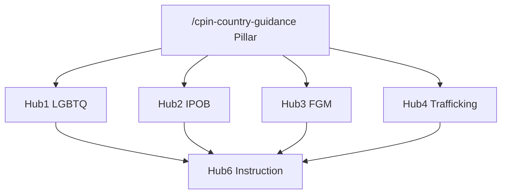
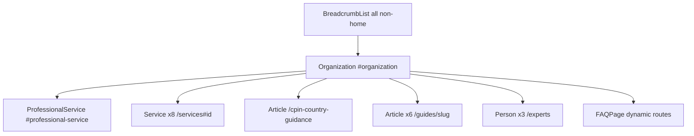

# SEO Architecture — nigeriaexpert.com

**Canonical domain:** `https://www.nigeriaexpert.com`  
**Site name:** NigeriaExpert  
**Locale:** `en_GB` (UK immigration solicitors, law firms, Legal Aid practitioners)

This document is the single source of truth for keyword strategy, content clusters, internal linking, GEO (Generative Engine Optimization), off-page SEO, schema architecture, and launch deployment for nigeriaexpert.com. All slugs and URLs align with the canonical SEO brief naming convention.

**Implementation status:** Implemented in codebase (June 2026). Canonical slugs, internal linking matrix (`data/related-links.ts`), GEO artifacts, schema, sitemap inventory (`lib/seo/publicUrlInventory.ts`), and 301 redirects (`lib/seo/slug-redirects.ts`) align with this document. Run `npm run seo:verify` after changes.

---

## 1. Keyword Strategy

### Tier 1 — Transactional

**Target pages:** homepage, services, asylum profiles, qualifications, case types, contact.

| Keyword | Primary URL |
|---------|-------------|
| Nigeria expert witness UK | `/` |
| Nigeria country expert UK | `/`, `/what-is-a-nigeria-expert-witness` |
| Nigeria asylum expert report UK | `/services`, `/how-to-instruct` |
| Nigeria country report asylum | `/services`, `/cpin-country-guidance` |
| Nigeria expert immigration tribunal | `/qualifications`, `/case-types/asylum-appeal-ftt` |
| Nigeria LGBTQ expert witness UK | `/asylum-profiles/lgbtq-asylum-nigeria` |
| Nigeria IPOB expert report UK | `/asylum-profiles/ipob-biafra` |
| Nigeria FGM expert witness UK | `/asylum-profiles/fgm-gbv` |
| Nigeria trafficking expert report | `/asylum-profiles/trafficking-juju` |
| Nigeria asylum solicitor expert | `/guides/instructing-nigeria-expert`, `/contact` |

### Tier 2 — Informational

**Target pages:** CPIN pillar, guides, asylum profiles, glossary.

| Keyword | Primary URL |
|---------|-------------|
| Nigeria CPIN 2025 2026 | `/cpin-country-guidance`, `/guides/nigeria-cpin-guide-solicitors` |
| Nigeria IPOB asylum UK | `/asylum-profiles/ipob-biafra`, `/guides/ipob-biafra-expert-guide` |
| Nigeria LGBTQ asylum state protection | `/asylum-profiles/lgbtq-asylum-nigeria`, `/cpin-country-guidance#sogiesc` |
| Nigeria FGM asylum evidence | `/asylum-profiles/fgm-gbv`, `/guides/fgm-nigeria-guide` |
| Nigeria country guidance case | `/cpin-country-guidance`, `/glossary#country-guidance-case` |
| Nigeria trafficking juju asylum UK | `/asylum-profiles/trafficking-juju`, `/guides/trafficking-juju-guide` |
| Nigeria internal relocation Lagos | `/asylum-profiles/internal-relocation-lagos`, `/cpin-country-guidance#internal-relocation` |
| Nigeria Boko Haram asylum UK | `/asylum-profiles/boko-haram-northeast`, `/cpin-country-guidance` |
| Nigeria actors of protection | `/asylum-profiles/actors-of-protection`, `/cpin-country-guidance#actors-of-protection` |
| Nigeria SOGIESC CPIN June 2025 | `/cpin-country-guidance#sogiesc`, `/asylum-profiles/lgbtq-asylum-nigeria` |

### Tier 3 — Long-tail

**Target pages:** asylum profiles, guides, case types, fees, qualifications.

| Keyword | Primary URL(s) |
|---------|----------------|
| IPOB asylum expert report UK | `/asylum-profiles/ipob-biafra`, `/case-types/ipob-biafra-asylum` |
| Nigeria LGBTQ SSMPA asylum expert | `/asylum-profiles/lgbtq-asylum-nigeria`, `/glossary#ssmpa` |
| Nigeria FGM daughter at risk expert report | `/asylum-profiles/fgm-gbv`, `/case-types/fgm-asylum` |
| Nigeria trafficking juju expert witness UK | `/asylum-profiles/trafficking-juju`, `/guides/trafficking-juju-guide` |
| Nigeria political persecution expert witness UK | `/asylum-profiles/political-persecution`, `/case-types/asylum-appeal-ftt` |
| Nigeria Boko Haram north east asylum expert | `/asylum-profiles/boko-haram-northeast`, `/case-types/asylum-appeal-ftt` |
| Nigeria EUAA country guidance 2026 | `/cpin-country-guidance#euaa-2026` |
| Nigeria asylum CPIN challenge expert UK | `/cpin-country-guidance`, `/guides/nigeria-cpin-guide-solicitors`, `/services#cpin-challenge` |
| Nigeria internal relocation expert report UK | `/asylum-profiles/internal-relocation-lagos`, `/case-types/upper-tribunal-nigeria` |
| Legal Aid Nigeria expert report asylum | `/fees`, `/guides/instructing-nigeria-expert`, `/how-to-instruct` |

### Keyword → URL implementation reference

| Cluster | URL pattern | Meta source |
|---------|-------------|-------------|
| Brand / transactional | `/` | Page-level `createMetadata()` |
| Asylum profile transactional | `/asylum-profiles/{slug}` | `metaTitle`, `metaDescription`, `h1` in `data/asylum-profiles.ts` |
| CPIN pillar / informational | `/cpin-country-guidance` | Page-level metadata + section anchors |
| Case-type transactional | `/case-types/{slug}` | `data/case-types.ts` |
| Informational guides | `/guides/{slug}` | `data/guides.ts` |
| Utility / process | `/how-to-instruct`, `/fees`, `/qualifications`, `/faq` | Page-level metadata |
| Services | `/services`, `/services#{id}` | `data/services.ts` |

---

## 2. Content Clusters

Six topical hubs drive internal linking, anchor text, and content depth. Hub 5 (CPIN Master) connects all profile and case-type spokes.



### Hub 1: LGBTQ+ Nigeria

| Role | URL |
|------|-----|
| Profile | `/asylum-profiles/lgbtq-asylum-nigeria` |
| Guide | `/guides/lgbtq-nigeria-asylum-guide` |
| Case type | `/case-types/lgbtq-asylum-nigeria` |
| Glossary | `/glossary#ssmpa` |
| CPIN section | `/cpin-country-guidance#sogiesc` |

### Hub 2: IPOB/Biafra

| Role | URL |
|------|-----|
| Profile | `/asylum-profiles/ipob-biafra` |
| Guide | `/guides/ipob-biafra-expert-guide` |
| Case type | `/case-types/ipob-biafra-asylum` |
| Glossary | `/glossary#ipob` |
| CPIN section | `/cpin-country-guidance#ipob-separatist` |

### Hub 3: FGM/GBV

| Role | URL |
|------|-----|
| Profile | `/asylum-profiles/fgm-gbv` |
| Guide | `/guides/fgm-nigeria-guide` |
| Case type | `/case-types/fgm-asylum` |
| Glossary | `/glossary#fgm` |

### Hub 4: Trafficking/Juju

| Role | URL |
|------|-----|
| Profile | `/asylum-profiles/trafficking-juju` |
| Guide | `/guides/trafficking-juju-guide` |
| Case type | `/case-types/trafficking-nrm` |
| Glossary | `/glossary#juju-rituals`, `/glossary#nrm` |

### Hub 5: CPIN Master

| Role | URL |
|------|-----|
| Pillar | `/cpin-country-guidance` |
| All profiles | `/asylum-profiles/[slug]` (8 pages) |
| All case types | `/case-types/[slug]` (8 pages) |
| CPIN guide | `/guides/nigeria-cpin-guide-solicitors` |

Hub 5 also connects secondary profiles not covered by Hubs 1–4:

- `/asylum-profiles/boko-haram-northeast`
- `/asylum-profiles/actors-of-protection`
- `/asylum-profiles/internal-relocation-lagos`
- `/asylum-profiles/political-persecution`

### Hub 6: Instruction Process

| Role | URL |
|------|-----|
| Process | `/how-to-instruct` |
| Credentials | `/qualifications` |
| Legal Aid fees | `/fees` (Legal Aid section) |
| Solicitor guide | `/guides/instructing-nigeria-expert` |

### Slug inventory

**Asylum profiles (8):**

`lgbtq-asylum-nigeria`, `ipob-biafra`, `boko-haram-northeast`, `fgm-gbv`, `trafficking-juju`, `actors-of-protection`, `internal-relocation-lagos`, `political-persecution`

**Case types (8):**

`asylum-appeal-ftt`, `upper-tribunal-nigeria`, `lgbtq-asylum-nigeria`, `fgm-asylum`, `trafficking-nrm`, `ipob-biafra-asylum`, `deportation-removal-nigeria`, `fresh-claims-nigeria`

**Guides (6):**

`nigeria-cpin-guide-solicitors`, `lgbtq-nigeria-asylum-guide`, `ipob-biafra-expert-guide`, `fgm-nigeria-guide`, `trafficking-juju-guide`, `instructing-nigeria-expert`

**Services (8 IDs):**

`country-condition-reports`, `lgbtq-asylum`, `ipob-biafra-risk`, `fgm-expert-reports`, `trafficking-juju-reports`, `cpin-challenge`, `internal-relocation-analysis`, `oral-evidence`

### Glossary anchor ID convention

Generate fragment IDs from term text:

```js
term.toLowerCase().replace(/[^a-z0-9]+/g, "-").replace(/^-|-$/g, "")
```

**SEO-critical anchor mappings:**

| Cluster reference | Glossary term | Canonical anchor ID |
|-------------------|---------------|------------------------|
| `#ssmpa` | SSMPA (Same Sex Marriage Prohibition Act 2013) | `ssmpa-same-sex-marriage-prohibition-act-2013` |
| `#ipob` | IPOB (Indigenous People of Biafra) | `ipob-indigenous-people-of-biafra` |
| `#fgm` | FGM (Female Genital Mutilation) | `fgm-female-genital-mutilation` |
| `#cpin` | Country Policy Information Note (CPIN) | `country-policy-information-note-cpin` |
| `#nrm` | National Referral Mechanism (NRM) | `national-referral-mechanism-nrm` |
| `#state-protection` | State Protection | `state-protection` |
| `#internal-relocation` | Internal Relocation Alternative | `internal-relocation-alternative` |
| `#country-guidance-case` | Country Guidance Case | `country-guidance-case` |
| `#juju-rituals` | Juju Rituals | `juju-rituals` |
| `#hj-iran` | HJ (Iran) [2010] | `hj-iran-2010` |

---

## 3. Internal Linking Rules

### Rule A — Every `/asylum-profiles/[slug]` must link to:

- `/cpin-country-guidance` (relevant CPIN section anchor)
- Relevant `/case-types/[slug]` page(s)
- Relevant `/guides/[slug]` page(s)
- `/how-to-instruct`
- `/contact`

### Rule B — Every `/guides/[slug]` must link to:

- Relevant `/asylum-profiles/[slug]` page(s)
- `/cpin-country-guidance`
- `/how-to-instruct`
- `/contact`

### Additional recommended rules

#### Every `/case-types/[slug]` must link to:

- Relevant `/asylum-profiles/[slug]` page(s)
- `/how-to-instruct`
- `/contact`

#### `/cpin-country-guidance` must link to:

- All 8 `/asylum-profiles/[slug]` pages
- All 6 `/guides/[slug]` pages
- `/how-to-instruct`
- `/contact`

#### Homepage must link to:

- Top 4 transactional profiles: LGBTQ+, IPOB, FGM, Trafficking
- `/cpin-country-guidance`
- `/asylum-profiles` hub
- `/guides` hub
- `/how-to-instruct`
- `/contact`

#### Glossary terms must link to:

- Most relevant `/asylum-profiles/[slug]`
- Most relevant `/guides/[slug]`
- `/cpin-country-guidance` where applicable

### Enforcement guidance

**Recommended data model extension** — add to `AsylumProfile`, `CaseType`, and `Guide`:

```ts
relatedLinks?: { label: string; href: string }[];
```

Populate from [Appendix D: Profile Minimum Links Matrix](#appendix-d-profile-minimum-links-matrix).

**Page template requirements:**

- Use a shared `RelatedLinks` or `ContentClusterNav` component in page shell.
- Breadcrumbs on all non-home pages.
- Glossary: render each term with `id={anchorId}` using canonical IDs from Section 2.
- Use descriptive anchor text (e.g. "June 2025 SOGIESC CPIN on Nigeria" not "click here").

**Cross-linking priority:** Hub pillar → profile/guide → instruction → contact.

---

## 4. GEO Optimization Targets

Content structured for AI citation and featured snippets: definition-first, tables, numbered steps, citeable statistics.

| # | URL | Required extractable artifact | Data / UI |
|---|-----|------------------------------|-----------|
| 1 | `/cpin-country-guidance` | Nigeria CPIN quick reference table (topic, version/date, key finding) | Pillar page table component |
| 2 | `/cpin-country-guidance` | EUAA 2026 country guidance summary | Section `#euaa-2026` |
| 3 | `/asylum-profiles/lgbtq-asylum-nigeria` | LGBTQ+ Nigeria legal position (SSMPA, Sharia states, state protection) | Profile lead + summary table |
| 4 | `/asylum-profiles/ipob-biafra` | IPOB risk explanation (proscription, arrest risk, diaspora activity) | Profile lead + risk factors list |
| 5 | `/asylum-profiles/trafficking-juju` | Juju rituals trafficking mechanism (definition-first, numbered steps) | Profile section with ordered list |
| 6 | `/qualifications` | Immigration Tribunal expert duties summary (Practice Direction para 10) | Qualifications page H2 block |
| 7 | `/fees`, `/how-to-instruct` | Legal Aid instruction process (LAA prior authority, typical rates) | Fees Legal Aid section + instruction steps |

**GEO content rules:**

- Lead with a direct answer paragraph (40–60 words) before depth.
- Tables use `<table>` with `<caption>` and header row for accessibility and parsing.
- Include source citations (OSCOLA-style) where statistics or CPIN positions are cited.
- Avoid gating key factual content behind accordions only.

**CPIN quick reference table (GEO #1) — required rows:**

| CPIN Topic | Version/Date | Key Finding |
|-----------|-------------|-------------|
| Actors of Protection | August 2024 | Protection generally limited outside Lagos/Abuja for many profiles |
| Separatist Groups South-East (IPOB) | April 2026 | Members/supporters face arrest risk |
| SOGIESC | June 2025 | State protection generally unavailable for LGBTQ+ |
| FGM | Updated 2024 | Enforcement of prohibition inconsistent |
| Trafficking of Women | Updated 2024 | State protection inadequate for victims |
| Medical Treatment | December 2025 | Variable access to healthcare |
| Internal Relocation | Current | Lagos and Abuja viable for some profiles only |

---

## 5. Off-Page SEO Targets

### Directories (listing submissions)

| Directory | URL | Target page to link |
|-----------|-----|---------------------|
| Electronic Immigration Network (EIN) | [ein.org.uk/experts](https://ein.org.uk/experts) | `/`, `/asylum-profiles/*` |
| ILPA membership directory | ILPA member directory | `/qualifications`, `/guides/*` |
| OISC accredited adviser directories | OISC adviser listings | `/`, `/how-to-instruct` |
| Free Movement | [freemovement.org.uk](https://freemovement.org.uk) | `/cpin-country-guidance`, `/guides/*` |
| Law Society immigration expert finder | Law Society directory | `/qualifications`, `/contact` |

**Submission tracking template:**

| Directory | Owner | Submitted | Live URL | Referral sessions/mo |
|-----------|-------|-----------|----------|----------------------|
| EIN | | | | |
| ILPA | | | | |
| OISC | | | | |
| Free Movement | | | | |
| Law Society | | | | |

### Publications (citations / guest content)

| Publication | Focus |
|-------------|-------|
| Free Movement | freemovement.org.uk — asylum, country guidance, CPIN challenges |
| ILPA | Immigration practitioners, tribunal practice |
| Legal Action Group (LAG) | Legal aid, tribunal practice |
| UK Human Rights Blog | Human rights, country conditions |

**Outreach KPI template:**

| Publication | Piece title | Published | Backlink URL | Domain rating |
|-------------|-------------|-----------|--------------|---------------|
| | | | | |

### Digital PR angles

1. **Nigeria CPIN 2025–2026: What UK Asylum Solicitors Need to Know** — supports `/cpin-country-guidance` and GEO #1–2.
2. **IPOB and UK Diaspora Activity: April 2026 CPIN Implications** — Hub 2, `/asylum-profiles/ipob-biafra`.
3. **SSMPA and the June 2025 SOGIESC CPIN: LGBTQ+ Nigeria Asylum Evidence** — Hub 1, `/asylum-profiles/lgbtq-asylum-nigeria`.
4. **Juju Rituals in Nigerian Trafficking Cases: What Experts Must Explain** — Hub 4, `/asylum-profiles/trafficking-juju`.
5. **Legal Aid Instruction of Nigeria Country Experts: A Solicitor's Checklist** — Hub 6, `/guides/instructing-nigeria-expert`.

---

## 6. Deployment Checklist

| Task | Implementation | Status |
|------|----------------|--------|
| Vercel deployment | Connect repo; production branch deploy | Pending |
| DNS: apex → www | `middleware.ts` 301 redirect + registrar `www` CNAME | Pending |
| `NEXT_PUBLIC_SITE_URL` | `https://www.nigeriaexpert.com` in `lib/constants.ts` or env | Pending |
| `NEXT_PUBLIC_FORMSPREE_FORM_ID` | Contact form component | Pending |
| `GOOGLE_SITE_VERIFICATION` | `metadata.verification.google` in `app/layout.tsx` | Pending |
| `BING_SITE_VERIFICATION` | `metadata.other` or Bing meta tag in layout | Pending |
| `NEXT_PUBLIC_GA_MEASUREMENT_ID` | Analytics component in layout (consent-gated) | Pending |
| `html lang="en-GB"` | Root layout `<html lang="en-GB">` | Pending |
| `hreflang` | `en-GB`, `en-US`, `x-default` in `alternates.languages` | Pending |
| Submit sitemap | GSC + Bing Webmaster — `app/sitemap.ts` | Pending (post-deploy) |
| LinkedIn company page | `NigeriaExpertWitness` → `sameAs` in Organization schema | Pending |
| EIN directory submission | ein.org.uk/experts | Manual post-launch |
| ILPA submission | ILPA membership directory | Manual post-launch |

**Canonical and robots:**

- All pages: canonical via `createMetadata()` in `lib/metadata.ts`
- Staging/preview: `noindex: true` on non-production hosts
- Production: `app/robots.ts` allow `/`, point to sitemap
- Exclude from sitemap: `/contact`, `/thank-you`, `/privacy`, `/terms`

**Reference implementation:** `africa-expert-witness/app/layout.tsx`, `africa-expert-witness/lib/metadata.ts`

---

## Appendix A: Full URL Inventory (~45 routes)

### Static and hub pages (15)

| URL | Sitemap priority |
|-----|------------------|
| `/` | 1.0 |
| `/cpin-country-guidance` | 0.95 |
| `/asylum-profiles` | 0.93 |
| `/services` | 0.90 |
| `/what-is-a-nigeria-expert-witness` | 0.90 |
| `/case-types` | 0.88 |
| `/how-to-instruct` | 0.88 |
| `/qualifications` | 0.88 |
| `/fees` | 0.87 |
| `/faq` | 0.87 |
| `/guides` | 0.87 |
| `/experts` | 0.75 |
| `/glossary` | 0.75 |
| `/contact` | 0.6 (excluded from sitemap) |
| `/thank-you` | noindex |

### Dynamic pages (30)

| Pattern | Count | Sitemap priority |
|---------|-------|------------------|
| `/asylum-profiles/{slug}` | 8 | 0.92 |
| `/case-types/{slug}` | 8 | 0.88 |
| `/guides/{slug}` | 6 | 0.82 |

### Legal / utility (noindex)

| URL | Robots |
|-----|--------|
| `/privacy` | noindex, follow |
| `/terms` | noindex, follow |
| `/thank-you` | noindex, nofollow |

**Total indexable URLs:** ~44 (excluding `/contact`, `/thank-you`, `/privacy`, `/terms`).

---

## Appendix B: Sitemap Priorities

| Route family | Priority |
|--------------|----------|
| `/` | 1.0 |
| `/cpin-country-guidance` | 0.95 |
| `/asylum-profiles` (hub) | 0.93 |
| `/asylum-profiles/[slug]` | 0.92 |
| `/services`, `/what-is-a-nigeria-expert-witness` | 0.90 |
| `/case-types` (hub), `/case-types/[slug]` | 0.88 |
| `/how-to-instruct`, `/qualifications` | 0.88 |
| `/fees`, `/faq`, `/guides` (hub) | 0.87 |
| `/guides/[slug]` | 0.82 |
| `/glossary`, `/experts` | 0.75 |

---

## Appendix C: Schema Architecture Summary

### Root entity

```json
{
  "@type": "Organization",
  "@id": "https://www.nigeriaexpert.com/#organization"
}
```

### Schema graph overview



### Children of Organization

| Type | Count | URL / @id | Notes |
|------|-------|-----------|-------|
| ProfessionalService | 1 | `/` — `#professional-service` | Homepage |
| Service | 8 | `/services#{id}` | See services inventory in Section 2 |
| Article | 1 | `/cpin-country-guidance` | CPIN pillar |
| Article | 6 | `/guides/{slug}` | Guide pages |
| Person | 3 | `/experts` | Expert listing |
| FAQPage | 24+ | All dynamic routes with FAQs | 2 FAQs minimum per profile/case type |
| BreadcrumbList | All non-home | Per-page | |
| WebSite | 1 | `/` | SearchAction optional |

### Page → schema template matrix

| Route | JSON-LD types |
|-------|---------------|
| `/` | Organization, ProfessionalService, WebSite |
| `/services` | Organization, Service ×8 |
| `/cpin-country-guidance` | Organization, Article, BreadcrumbList, FAQPage |
| `/guides/[slug]` | Organization, Article, BreadcrumbList |
| `/asylum-profiles/[slug]` | Organization, BreadcrumbList, FAQPage |
| `/case-types/[slug]` | Organization, BreadcrumbList, FAQPage |
| `/experts` | Organization, Person ×3 |
| `/faq` | Organization, FAQPage, BreadcrumbList |
| `/glossary` | Organization, BreadcrumbList |
| Static utility pages | Organization, BreadcrumbList |

**LinkedIn `sameAs`:** `https://www.linkedin.com/company/NigeriaExpertWitness`

---

## Appendix D: Profile Minimum Links Matrix

Minimum internal links per Section 3 Rule A. Implement via `relatedLinks` or page template.

| Profile slug | CPIN anchor | Case types | Guides |
|--------------|-------------|------------|--------|
| `lgbtq-asylum-nigeria` | `#sogiesc` | `lgbtq-asylum-nigeria`, `asylum-appeal-ftt` | `lgbtq-nigeria-asylum-guide` |
| `ipob-biafra` | `#ipob-separatist` | `ipob-biafra-asylum`, `asylum-appeal-ftt` | `ipob-biafra-expert-guide` |
| `boko-haram-northeast` | — | `asylum-appeal-ftt`, `fresh-claims-nigeria` | `nigeria-cpin-guide-solicitors` |
| `fgm-gbv` | — | `fgm-asylum`, `asylum-appeal-ftt` | `fgm-nigeria-guide` |
| `trafficking-juju` | — | `trafficking-nrm`, `asylum-appeal-ftt` | `trafficking-juju-guide` |
| `actors-of-protection` | `#actors-of-protection` | `asylum-appeal-ftt`, `upper-tribunal-nigeria` | `nigeria-cpin-guide-solicitors` |
| `internal-relocation-lagos` | `#internal-relocation` | `upper-tribunal-nigeria`, `asylum-appeal-ftt` | `nigeria-cpin-guide-solicitors` |
| `political-persecution` | — | `asylum-appeal-ftt`, `deportation-removal-nigeria` | `nigeria-cpin-guide-solicitors` |

**All asylum profile pages:** `/how-to-instruct`, `/contact`

### Guide → profile links (Rule B)

| Guide slug | Required profile links |
|------------|------------------------|
| `nigeria-cpin-guide-solicitors` | All 8 profiles (or top 4 + link to hub) |
| `lgbtq-nigeria-asylum-guide` | `lgbtq-asylum-nigeria` |
| `ipob-biafra-expert-guide` | `ipob-biafra` |
| `fgm-nigeria-guide` | `fgm-gbv` |
| `trafficking-juju-guide` | `trafficking-juju` |
| `instructing-nigeria-expert` | Top 4 transactional profiles |

---

## Appendix E: Recommended Build Order

1. Root layout (`lang="en-GB"`, hreflang), `createMetadata()`, `JsonLd`, Header/Footer
2. Data layer: `asylum-profiles.ts`, `case-types.ts`, `guides.ts`, `glossary.ts`, `services.ts`
3. Dynamic routes: `/asylum-profiles/[slug]`, `/case-types/[slug]`, `/guides/[slug]`
4. Static pages: `/cpin-country-guidance`, `/services`, `/how-to-instruct`, `/qualifications`, `/fees`, `/faq`, `/glossary`, `/contact`, `/experts`
5. Homepage with top 4 profile links, CPIN pillar link, guides hub
6. `RelatedLinks` component + Appendix D matrix
7. GEO tables on `/cpin-country-guidance` and profile pages (Section 4)
8. `app/sitemap.ts`, `app/robots.ts`, env verification tags
9. `middleware.ts` apex → www redirect
10. Post-launch: EIN and ILPA directory submissions, GSC/Bing sitemap submit

---

## Document control

| Version | Date | Notes |
|---------|------|-------|
| 1.0 | 2026-06-09 | Initial SEO architecture for nigeriaexpert.com |

**Related files (to be created):** `lib/metadata.ts`, `lib/schema.ts`, `lib/constants.ts`, `middleware.ts`, `data/asylum-profiles.ts`, `data/case-types.ts`, `data/guides.ts`, `data/glossary.ts`
